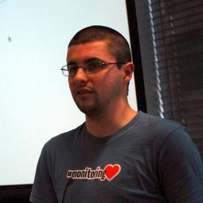

# Wes Mason

## Short bio
Wes is a polyglot developer with nearly two decades of experience programming large scale networked applications and release engineering.

## Long bio
Wes is a polyglot developer with over 17 years of experience programming large scale networked applications and release engineering.

Currently works as a Senior DevOps Engineer for [Street Team](https://www.getstreetteam.com/), releases lots of [open source goodness](http://git.io/1v) via the Internets, and lives in Yorkshire, England with wife, mischievous 6 year Morgan, and giggly 1 year old Matthew.

Wes also used to curate [PHP Weekly](http://phpweekly.info/), sometimes curates [Tips for Git](https://twitter.com/tipsforgit), and has even been known to [publish comic books](http://gfbowl.com/).

## Portrait
**TODO**
